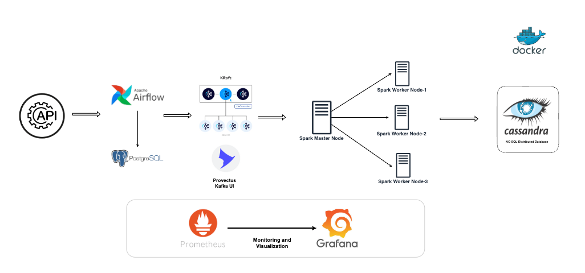

# Enterprise-Grade Real-Time Data Processing Platform


## Project Overview

This project designs and implements a production-grade, scalable, real-time data processing platform using industry-standard open-source technologies.
It ingests user profile data from an external API, orchestrates workflows with Airflow, streams events through Kafka, processes data using Spark Streaming, applies data quality checks, and stores the results in a distributed NoSQL database (Cassandra).
The entire system is fully containerized, deeply monitored, and designed for high availability, scalability, and observability ensuring production-grade reliability.


## Project Structure

```
├── constants/                      
├── dags/                           # Apache Airflow DAGs for orchestration
├── monitoring/                     # Observability setup
│   ├── alertmanager/               
│   ├── grafana/                    
│   ├── jmx_exporter/               
│   ├── prometheus/                 
│   └── spark/                      
├── pipelines/                      # Data processing pipelines
├── scripts/                        # Utility and test scripts
├── spark_streaming/                # Spark streaming & data quality checks
├── volumes/                        # Storage and configuration files
│   └── jmx_exporter/               
├── docker-compose.yml              # Docker Compose service definitions
└── README.md
```

## Project Architecture 



### Data Flow
1. **Data Source**: External API providing user profile data
2. **Workflow Orchestration**: Apache Airflow manages the ETL workflow
3. **Message Streaming**: Apache Kafka handles real-time data streaming
4. **Processing Engine**: Apache Spark performs distributed data processing
5. **Data Storage**: Apache Cassandra stores the processed data
6. **Monitoring**: Prometheus and Grafana for system observability

### Key Technologies

- **Apache Airflow**: Workflow orchestration and scheduling
- **Apache Kafka**: Distributed event streaming platform
- **Apache Spark**: Distributed data processing with Spark Streaming
- **Apache Cassandra**: Distributed NoSQL database
- **Prometheus**: Metrics collection and monitoring
- **Grafana**: Visualization and dashboarding
- **Docker & Docker Compose**: Containerization and service orchestration
- **JMX Exporter**: Java application metrics collection
- **PostgreSQL**: Backend database for Airflow


## Technological Challenges Solved

1. **Integration Complexity**: Successfully integrated multiple distributed systems with different communication protocols and data formats
2. **Deep Observability**: Configured JVM exporters, Prometheus scrapes, and Grafana dashboards.
3. **Production-Ready Monitoring**: Created live, auto-refreshing Grafana panels to monitor latency, throughput, and cluster health.
4. **Resource Optimization**: Tuned container memory/CPU for JVM-heavy systems (Kafka, Spark).
5. **Fault Tolerance**: Ensured resilient system recovery across restarts and component failures.


## Getting Started


### Setup and Execution

1. Clone the repository
   ```bash
   git clone https://github.com/Atharv-Nanaware/realtime-production-grade-pipeline.git
   ```
   ```bash
   cd realtime-production-grade-pipeline.git
   ```

2. Start the entire pipeline
   ```bash
   docker-compose up -d
   ```

3. Access the services :
   - Airflow: http://localhost:8080 (airflow/airflow)
   - Kafka UI: http://localhost:8085

   Run the Airflow DAG , it will automatically create the required Kafka topics.  
   You can verify the topics using Kafka UI.

4. Run the Spark Job:
   ```bash
   docker exec -e PYTHONPATH="/opt/spark/constants:/opt/spark/spark_streaming" spark-master \
   spark-submit --packages com.datastax.spark:spark-cassandra-connector_2.12:3.5.1,org.apache.spark:spark-sql-kafka-0-10_2.12:3.5.1 \
   /opt/spark/spark_streaming/spark_processing.py
   ```

5. Monitoring :
   - Prometheus: http://localhost:9090
   - Grafana: http://localhost:3000 (admin/admin)


   


## Dashboard Features

The monitoring dashboard provides:
- System component status (Kafka, Spark Master, Spark Workers)
- System performance metrics (JMX scrape duration for Kafka and Spark)
- JMX scrape duration indicators
- System health status (service health, active brokers, etc.)

## Extending the Project


### Enhancing Monitoring
1. Add custom metrics to the JMX exporter configurations
2. Update Prometheus scrape configurations
3. Create or modify Grafana dashboard panels

### Scaling Components
1. Adjust resource allocations in docker-compose.yml
2. In this setup, a single Kafka node is used for simplicity.
In production, it is recommended to use three Kafka controller nodes (KRaft mode) along with multiple brokers for fault tolerance and scalability.
3. Configure appropriate replication factors for Kafka topics and Cassandra keyspaces.


Developed by Atharv Nanaware | [LinkedIn](https://linkedin.com/in/atharvnanaware)